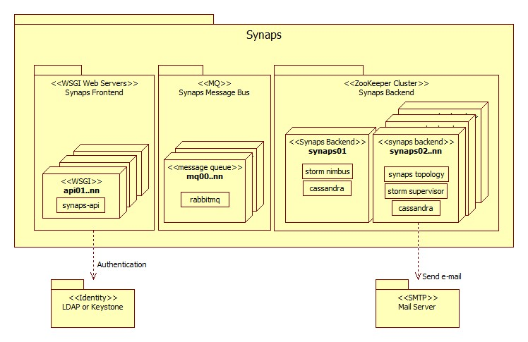

.. _general.installation.guide:

Installation Guide
==================

This instruction describes how to install Synaps.

.. toctree::
    :maxdepth: 3

    install/preinstall.common.rst
    install/install.synaps.rst    
    install/install.cassandra.rst
    install/install.storm.rst
    install/install.rabbitmq.rst    
    install/postinstall.backend.rst
    install/postinstall.frontend.rst
    

Installaton Example
-------------------
    
Below image is an example of Synaps deployment.

For Synaps Frontend cluster(api01 ~ nn),

* :ref:`preinstall.common`
* :ref:`install.synaps`
* :ref:`postinstall.frontend` 

For Synaps Backend cluster(synaps01 ~ nn), 

* :ref:`preinstall.common`
* :ref:`install.synaps`
* :ref:`install.cassandra`
* :ref:`install.storm`
* :ref:`postinstall.backend` 

For Synaps Message Bus(mq01..nn),

* :ref:`preinstall.common`
* :ref:`install.rabbitmq`    

For Synaps Development Environment (Installation on a single box)

* :ref:`preinstall.common` (optional)
* :ref:`install.synaps`
* :ref:`postinstall.frontend` 
* :ref:`install.cassandra`
* :ref:`install.storm`
* :ref:`postinstall.backend` (optional)
* and then, see :ref:`developersguide`
