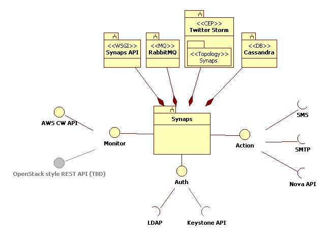
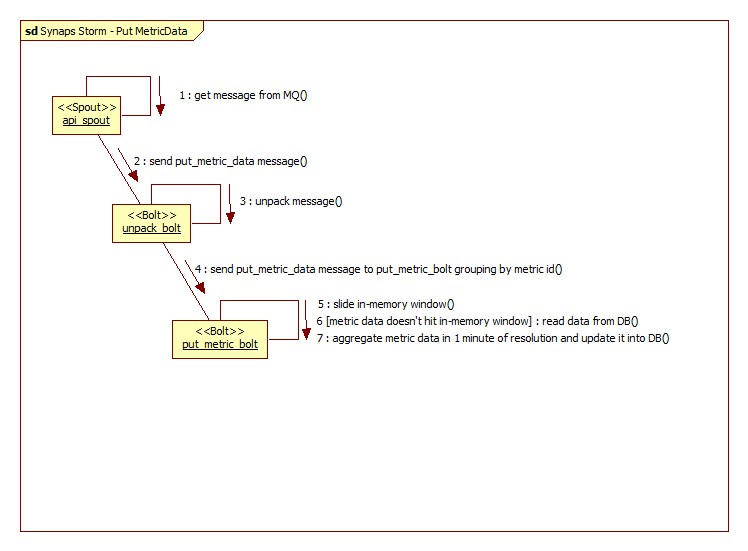

..
      Copyright 2012 Samsung SDS.
      All Rights Reserved.

Program Specification
=====================

Program Architecture
--------------------

If there are 1,000 VM instances in your cloud, and 10 metrics per instance are
inputed to the Synaps, it should process 10,000 metrics in a minute. And if 
your cloud runs well, you would have more VMs. So it should be distributed and 
scalable.

Synaps API is frontend of the system. Keystone can be integrated for 
authentication as well as LDAP. It uses RabbitMQ for asynchronous messaging. 

Synaps topology runs on the Twitter Storm, the real-time distributed stream 
processing system. Storm manages distributing workers in the topology and 
handles failed workers.

The topology pulls messages from the queue, aggregates metric data and 
evaluates alarms in-memory, and write the result into Cassandra database. So 
that it helps reducing read operations that cost a lot. It invokes actions when 
the status of alarm has been changed. It can be integrated with mail server and 
SMS agents to send notifications to user-specified contact list and Nova API to 
reboot or migrate specified VMs.

Cassandra no-sql database is used for storing persistent data which is 
massively fast for writing operation and provides good availability and 
scalability. Deploying Cassandra and synaps-topology together can be a good 
choice for performance. 

Each component of Synaps is linear scalable. 

   
   Synaps Architecture Overview
      

Synaps provides AWS CloudWatch compatible API so that users can use the SDKs
for AWS CW for Synaps also. Boto, AWS CLI and AWS SDK for Java can be used
to call Synaps API. 

Internally, it can be integrated with agent which inputs your metrics of your 
cloud services so that users can monitor their resource in the cloud.   

For example, VMMON which can get information from VM Hyperisor via libvirt APIs
and Nova API and put metric data to Synaps so that users can utilize the data. 
But such agents are not in the scope of Synaps project.

.. figure:: ../images/diagrams/IntegratedSystemOverview.jpg
   :width: 100%

   Synaps Integration Example

Synaps API description
----------------------

Synaps API is WSGI based web server which provides AWS CloudWatch compatible 
API.

Asynchronous request processing
~~~~~~~~~~~~~~~~~~~~~~~~~~~~~~~

Actions below are processed asynchronously. 

* DeleteAlarms
* PutMetricAlarm
* PutMetricData
* DisableAlarmActions
* EnableAlarmActions
* SetAlarmState

.. figure:: ../images/diagrams/SynapsAPI-PutMetricData.jpg
   :width: 100%

   Example of asynchronous message processing
   
Synchronous request processing
~~~~~~~~~~~~~~~~~~~~~~~~~~~~~~

Actions below are processed synchronously.
      
* DescribeAlarmHistory
* DescribeAlarms
* DescribeAlarmsForMetric
* GetMetricStatistics
* ListMetrics

For example,

.. figure:: ../images/diagrams/SynapsAPI-GetMetricStatistics.jpg
   :width: 100%
   
   Example of synchronous message processing

Synaps topology description
---------------------------

Synaps topology is aimed to run on the Twitter Storm, real-time distributed 
stream processing system.   

 .. figure:: ../images/diagrams/SynapsStorm-Topology.jpg
   :width: 100%
   
   Synaps topology for Storm

PutMetricData message processing
~~~~~~~~~~~~~~~~~~~~~~~~~~~~~~~~

This function is the most important part of Synaps. When the PutMetricData 
message is received via RabbitMQ message queue, it reads its in-memory sliding 
windows or database to aggregate its datapoints and evalutate status of 
its alarms. If the status is changed, it sends action message to notification 
queue.
   

   
   Synaps topology - PutMetricData

PutMetricAlarm message processing
~~~~~~~~~~~~~~~~~~~~~~~~~~~~~~~~~

When the PutMetricAlarm message is received via RabbitMQ message queue, it
find its metric and update its in-memory alarm data and update it into 
database. 
   
.. figure:: ../images/diagrams/SynapsStormPutMetricAlarm.jpg
   :width: 100%
   
   Synaps topology - PutMetricAlarm

PeriodicMonitoring message processing
~~~~~~~~~~~~~~~~~~~~~~~~~~~~~~~~~~~~~

'check_spout' generates PeriodicMonitoring message every 1 minute. When this is
generated, it checks their whole alarms if they are not evaluated alarms 
recently PutMetricData message processing.

.. figure:: ../images/diagrams/SynapsStormPeriodicMonitoring.jpg
   :width: 100%

   Synaps topology - PeriodicMonitoring